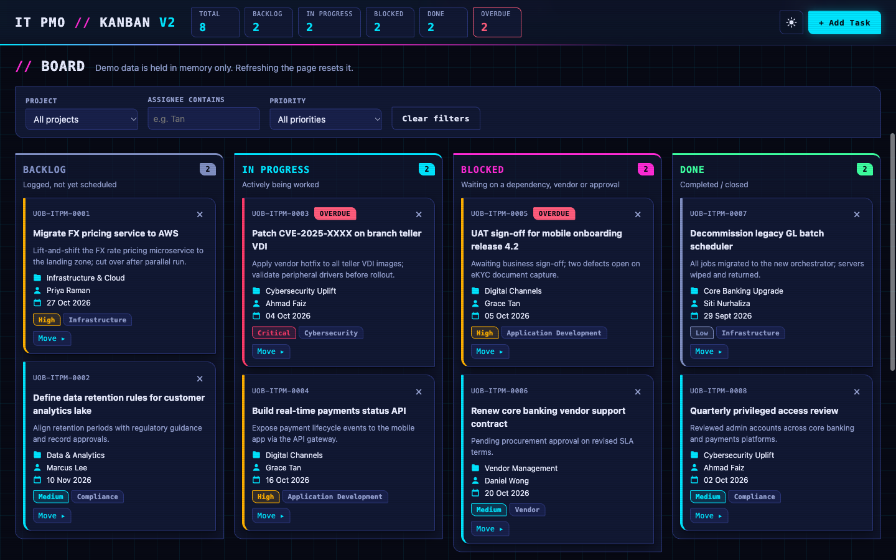
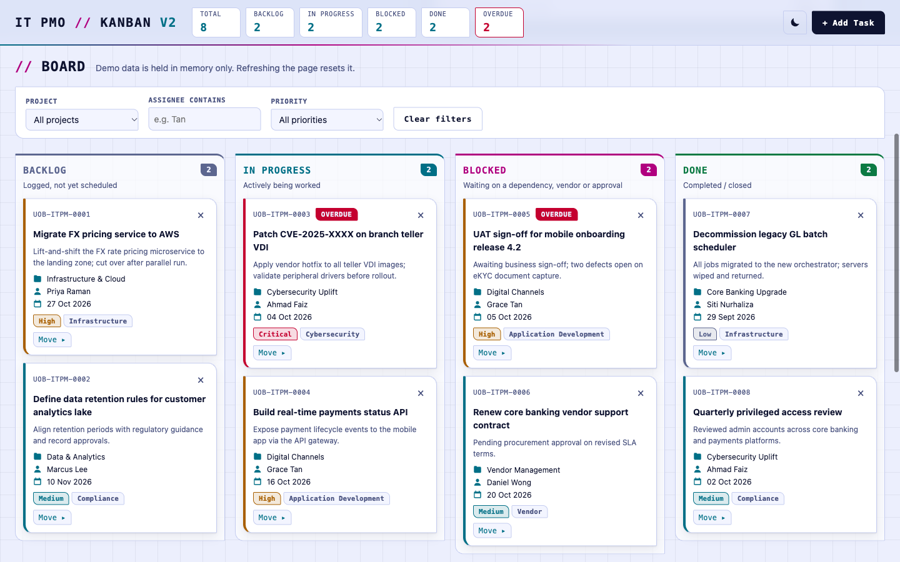

# IT PMO Kanban v2

[](https://github.com/chinazur/kanban5-v2/actions/workflows/ci.yml)
[](https://github.com/chinazur/kanban5-v2/actions/workflows/pages.yml)

A cyberpunk-styled revamp of the IT PMO Kanban board: a demo and training tool for the internal IT PMO of a fictitious bank. It has light and dark themes, a hero walkthrough video and a screenshot gallery, and it is plain HTML, CSS and JavaScript with no build step.

**Live demo:** https://chinazur.github.io/kanban5-v2/
**v1 (original blue single-file board):** https://chinazur.github.io/kanban5/

> Demo only. Data is held in memory, so refreshing the page resets the board to its seed data.





## What's new in v2

- **Cyberpunk look** with neon cyan and magenta accents, chamfered corners, a monospace display face and a faint scanline layer in the dark theme.
- **Light and dark themes.** It follows your system setting, and the header button switches it. The choice is not stored, so a refresh returns to the system theme.
- **Hero walkthrough video** recorded from the live app with Playwright. It autoplays muted, has a Pause button and stays paused if you prefer reduced motion.
- **Screens gallery** with light and dark captures, shown to match the current theme.
- **Accessibility:** skip link, visible focus ring in both themes, labelled controls, inline errors linked to their fields, and `prefers-reduced-motion` respected.
- **Responsive:** compact header and a single-column board on phones.

## Features (unchanged from v1)

- Four columns: Backlog, In Progress, Blocked and Done.
- Add Task form with inline validation.
- Move cards by drag and drop or the keyboard-accessible Move menu.
- Delete with an inline "Delete? Yes / No" confirmation.
- Filters by project, assignee and priority.
- Live header summary and overdue highlighting.
- `UOB-ITPM-####` task IDs.
- Optional email notification per new task via [FormSubmit](https://formsubmit.co).

## Tech stack

HTML5, CSS custom properties (theme tokens), vanilla JavaScript, native drag and drop, inline SVG, system fonts. GitHub Actions for CI and Pages.

## Getting started

```bash
git clone https://github.com/chinazur/kanban5-v2.git
cd kanban5-v2
open index.html          # works from file://
# or serve it:
python3 -m http.server 8766   # then open http://127.0.0.1:8766/
```

### Email notifications (optional)

Set the address in `FORMSUBMIT_ENDPOINT` at the top of `js/app.js`:

```js
const FORMSUBMIT_ENDPOINT = "https://formsubmit.co/ajax/YOUR_EMAIL@example.com";
```

FormSubmit needs a one-time activation: the first submission to a new address sends a confirmation email. The address is visible in the public page source.

### Checks

```bash
node --check js/app.js
grep -nE 'localStorage|sessionStorage|indexedDB|document\.cookie|alert\(|confirm\(|!important' index.html css/styles.css js/app.js   # prints nothing
```

## Project structure

```
.
├── index.html                 # Markup: header, hero, filters, board, gallery, modal
├── css/styles.css             # Theme tokens (light + dark) and all styles
├── js/app.js                  # Board logic (from v1) + theme toggle + hero video
├── assets/
│   ├── screens/               # Light and dark screenshots (Playwright)
│   └── video/                 # Walkthrough recording and poster
├── CLAUDE.md                  # Architecture notes and project rules
└── .github/workflows/
    ├── ci.yml                 # Syntax, asset, external-resource and secret checks
    └── pages.yml              # Publishes the site to GitHub Pages
```

## CI/CD

- **CI** runs on pushes and pull requests to `main`: JS syntax, referenced assets exist, no external resources, and a Gitleaks secret scan.
- **Deploy** runs on pushes to `main` (or manually) and publishes `index.html`, `css/`, `js/` and `assets/` to Pages.

## Contributing

Issues and pull requests are welcome. Keep to the rules in [CLAUDE.md](CLAUDE.md): vanilla JS, no external resources, no persistence. Make sure CI passes.

## License

No license has been specified yet. All rights reserved by the author until one is added.

## Disclaimer

This is a fictitious demo. It isn't affiliated with, endorsed by or meant to imitate any real bank or its systems. The screenshots and video are recordings of this app, not AI-generated.
